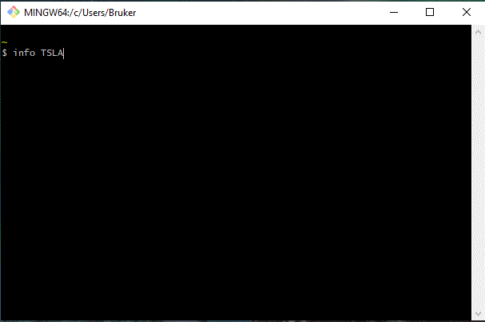
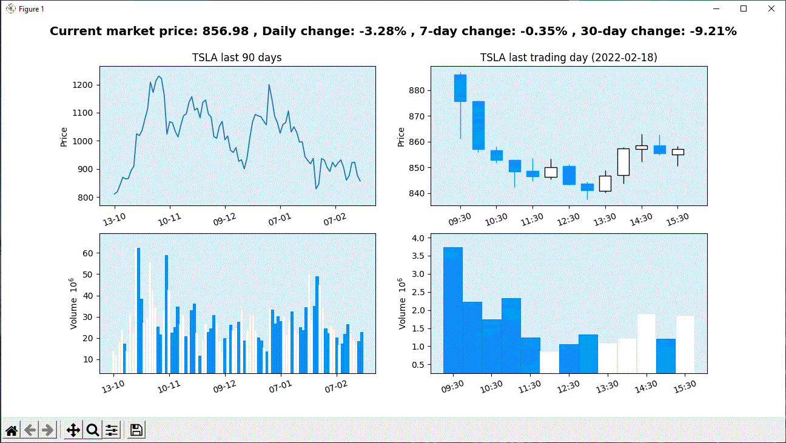
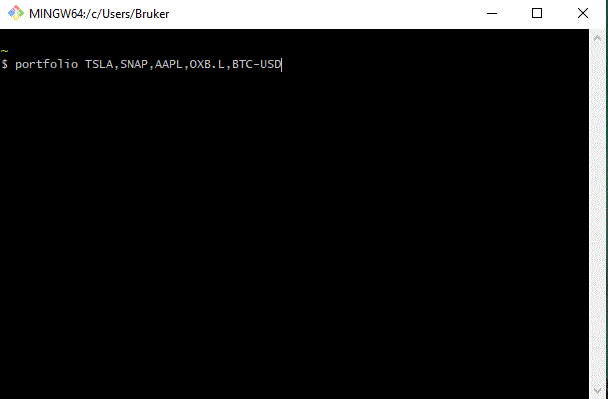
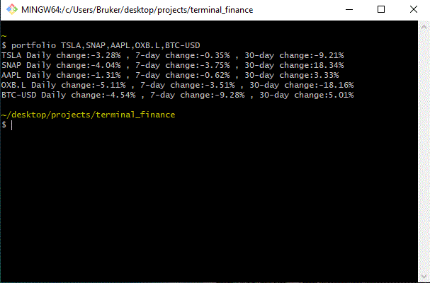

A set of bash-terminal tools for personal finance

- The tools utilize the Yahoo Finance API
- Work for all tickers listed on Yahoo Finance, including cryptocurrency trading pairs (e.g. TSLA, AAPL, BTC-USD, ETH-USD) 

# Stock_overview.py

**Input:** One-line command in bash terminal (info TICKER)

**Output:** Pop-out matplotlib window with historic price movement and trading volumes for that ticker

# Portfolio.py

**Input:** One-line command in bash terminal  (portfolio LIST,OF,TICKERS)

**Output:** Returns daily change, 7-day change and 30-day change for all tickers

