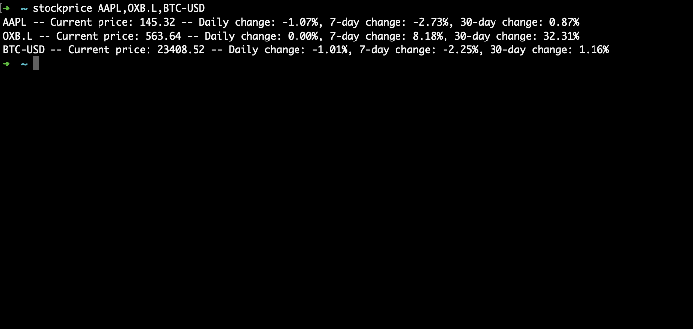

# Stockprice

**Input:** One-line command in terminal  (stockprice LIST,OF,TICKERS)


**Output:** Returns daily change, 7-day change and 30-day change for all tickers



## Installation
Using [pipx](https://pypa.github.io/pipx/)
```
pipx install stockprice-cli
```

Alternatively, using pip (or pip3):
```
pip install stockprice-cli
```