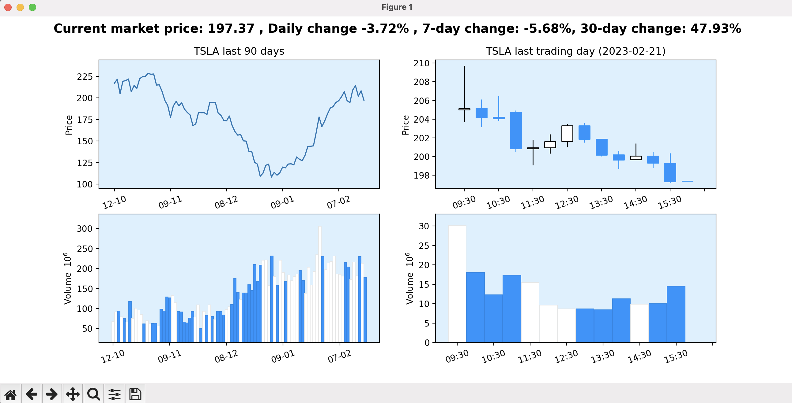
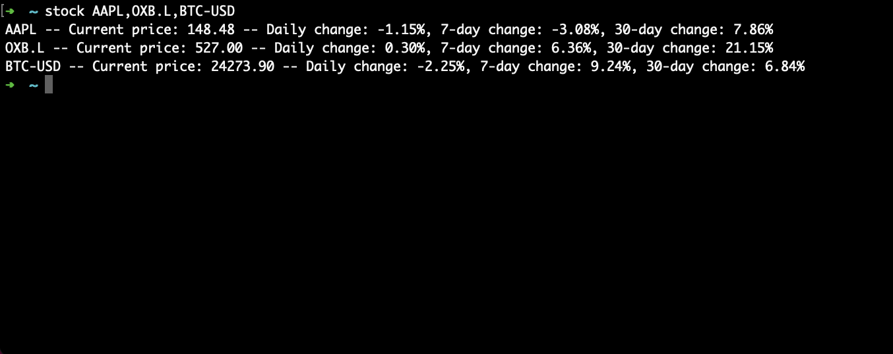

A set of terminal tools for personal finance

- The tools utilize the Yahoo Finance API
- Work for all tickers listed on Yahoo Finance, including cryptocurrency trading pairs (e.g. TSLA, AAPL, BTC-USD, ETH-USD) 
- Works for terminals running unix shells (e.g. Bash, Zsh)

# Stockplot.py

**Input:** One-line command in terminal (stockplot TICKER)

**Output:** Pop-out matplotlib window with historic price movement and trading volumes for that ticker

# Stock.py

**Input:** One-line command in terminal  (stock LIST,OF,TICKERS)

**Output:** Returns daily change, 7-day change and 30-day change for all tickers

## Steps to setup locally 
Before running the commands below, make sure `pipenv` is installed
1. Clone this repository
2. `pipenv install` in this directory
3. `./install.sh` in this directory
